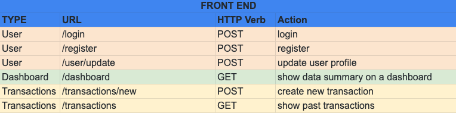
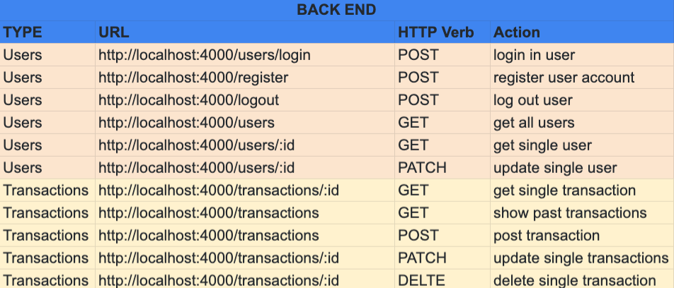
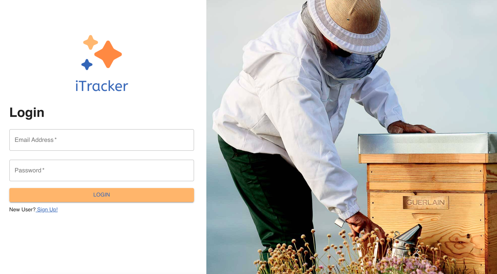
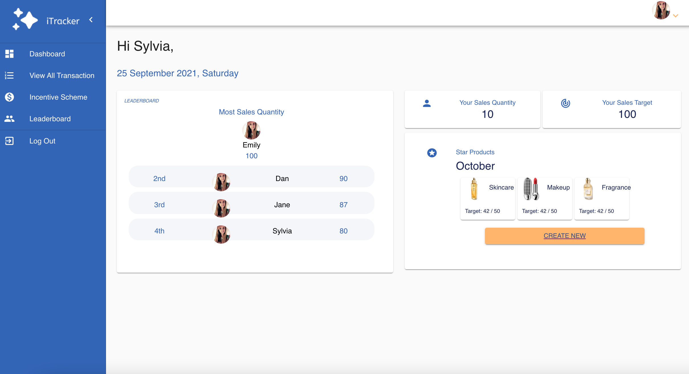
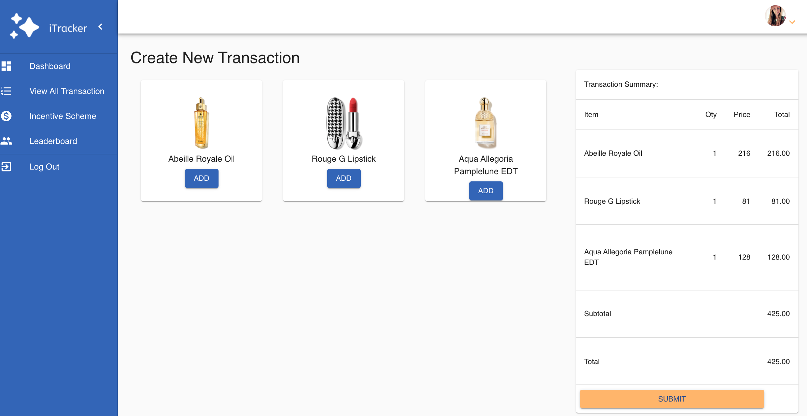
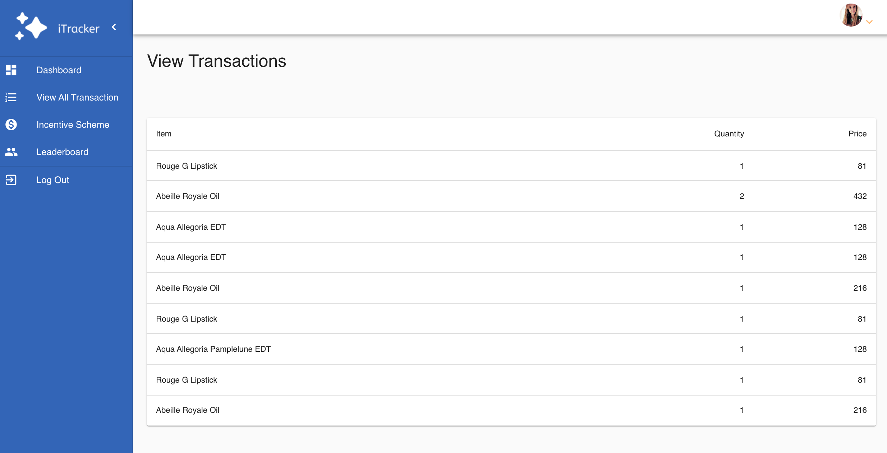

<h1>iTracker</h1>

PROBLEM: In a retail department store setting, brands have no visibility of daily sales achieved. Brands receive sales report on a monthly basis. 

OBJECTIVE: <a href="https://itracker-fe.herokuapp.com/">iTracker</a> is an App created for internal use so brands/ retail managers can track and monitor daily sales at a store. Each retail staff will have an account to input their own transaction similarly to a POS system. 

 

<h2> Application Features </h2>
1. Dashboard  
2. Create Transactions 
3. View Transactions 
4. Login Page 
5. Register Page 

 
<h2>Technologies used</h2>
- React 
- Toastify 
- Material UI 
- SQL TypeORM 
- Nestjs - Typescript 
- Bcrypt 
- AXIOS 
- CORS 
- DOTENV 
- JSON Web Token 

 

<h2>Routes / Pages</h2>
<h3>Front End:</h3>

  
<h3>Back End:</h3>

 
 
<h2>The Approaches Taken</h2>
1. Research on best practices and design inspiration 
2. App Name Exploration  
3. Wireframe / Design mock up & logo design using Figma 
4. Determine the routes and data needed 
5. Reseach and explore NestJS  
6. Start working on Backend using NestJS 
7. Deploying Backend on Postman 
8. Work on on Frontend using React & MaterialUI  
9. Deploying Front End onto Heroku
 
 

<h2>App Design</h2>

  
<h2>Unsolved Problems</h2>
1. Bug on Add Transaction Item: Duplicated item will not increase quanity count  
2. Leaderboard  
 

<h2>Note to self</h2>
1. Further improve on app features e.g. edit and delete transaction, update user profile, inputing transaction date per item 
2. Code Refactor 
 

<h2>Application Front Deployed on Heroku</h2>
1. <a href ="https://itracker-fe.herokuapp.com/">iTracker Front End
 </a> 

<h2>Github Repositories</h2>
1. <a href ="https://github.com/xinyingchua/itracker-fe">Front-End Repo
 </a> 
2. <a href ="https://github.com/xinyingchua/itracker-be">Back-End Repo
 </a> 
